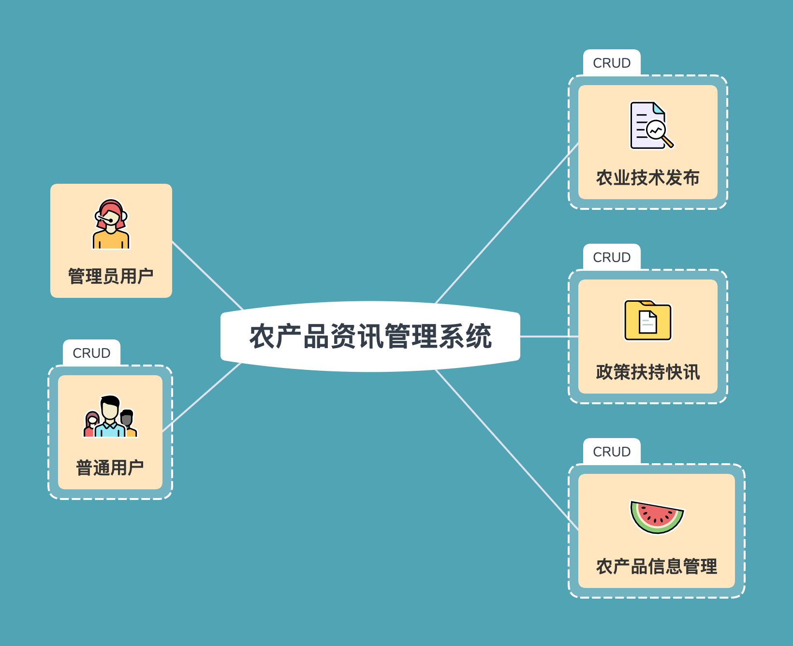
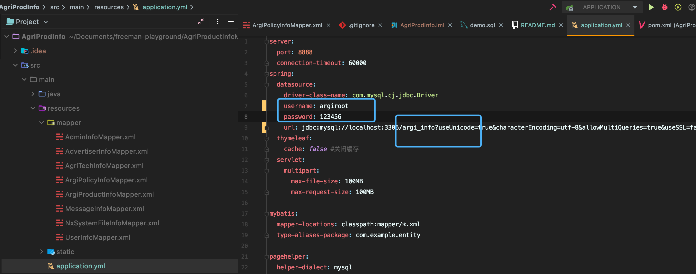

# AgriProdInfo 农产品资讯管理系统

## 系统环境准备

## 软件安装

[JDK1.8下载](https://www.oracle.com/cn/java/technologies/javase/javase-jdk8-downloads.html)

[JDK安装指引](https://blog.csdn.net/weixin_42109012/article/details/94388518)

[Apache Maven安装配置](https://blog.csdn.net/shixianyiyu5277/article/details/80397832)

[IntelliJ IDEA](https://blog.csdn.net/weixin_44323869/article/details/90546148)

## 配置数据库

### 登入本地数据库

    mysql -u root -p
    
### 创建用户并且授权

创建应用程序数据库

    DROP DATABASE `argi`;
    
    CREATE DATABASE  `argi` DEFAULT CHARACTER SET utf8 COLLATE utf8_general_ci;
    
    CREATE USER 'argiroot'@'localhost' IDENTIFIED BY  '123456';
    
    GRANT ALL PRIVILEGES ON  `argi` . * TO  'argiroot'@'localhost';
    
    flush privileges;
    
 注意，以上配置默认数据库和应用程序包部署在同一台主机上，所以主机名是`localhost`
 
 此外，应用程序访问数据库的用户名是`argi_root`,密码是`123456`
 
 实际部署的时候可以改动密码，只需要应用程序的数据库连接配置的地方作相应改动
 
 
 
 ### 切换数据库并导入数据库脚本
    
 最新版的IDEA里面可以创建数据库连接，配置好数据源以后，直接在编辑器中打开`argi_db.sql`、选择数据源并运行，如果有问题，请参考IDEA使用指导文档
 
 ## 导入项目
 
 [导入项目](https://www.cnblogs.com/dpl9963/p/10075456.html)
 
 注意，上面的链接文章总包含了如何在`IDEA`中配置`Maven`的具体步骤，如果代码无法编译构建，请注意配置好自己电脑上`Maven`安装包和和`Maven仓库`的文件路径
 
 ## 打开首页
 
 [本地首页](http://localhost:8888/front/index.html)
 
 
